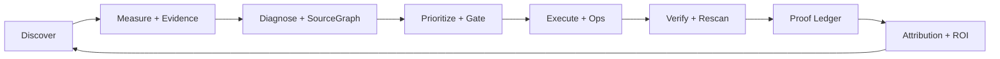

# PresenceOS — OmniPresence Engine

Evidence-backed organic visibility operating system: measure → diagnose → prioritize → execute → verify → prove → attribute across Google, AI surfaces, backlinks, technical SEO, and first-party attribution.

## What ships today (v24)

| Capability | Status |
|------------|--------|
| **13-gate Presence Gate** | Minimum-gate readiness score; marketing superlatives gated on ≥60 all gates |
| **Measurement evidence spine** | `measurement_evidence` + `ai_capture_evidence` — tamper-evident proof for measured metrics |
| **Sovereign OmniData** | SERP, rank, backlinks, crawl — `/v1/presence/*` on Railway |
| **AI UI capture** | Playwright capture service (screenshots, DOM, hash) on Railway |
| **Refund-safe guarantee** | Two-tier: deterministic deliverables + measured lift with connector-gated ROI |
| **47 project modules** | Keywords, ranks, SERP, backlinks, source graph, ops queue, proof ledger, ROI |
| **Benchmark scorecard** | 88 golden entries — `npm run benchmark` |

## Architecture



## Production target

| Component | Host | Role |
|-----------|------|------|
| Next.js app | **Vercel** | UI, API routes, Inngest, auth |
| OmniData | **Railway** | Sovereign SERP/rank/keyword/backlink/maps |
| ai-ui-capture | **Railway** | Playwright AI surface capture |

Sign-off: `npm run production:ready` green locally **and** smoke against Vercel + Railway health checks.

### GitHub Actions production gate

Weekly + on `main` push: `.github/workflows/production-gate.yml` runs `verify:all`, and when secrets are set also `railway:verify` and `production:ready`.

| Secret | Purpose |
|--------|---------|
| `SMOKE_BASE_URL` | Production app URL for smoke tests |
| `OMNIDATA_BASE_URL` | Railway OmniData health |
| `OMNIDATA_API_KEY` | OmniData auth |
| `AI_UI_CAPTURE_URL` | Railway ai-ui-capture health |
| `GOOGLE_CLIENT_ID` / `GOOGLE_CLIENT_SECRET` | Attribution claim backing (optional) |
| `CLAIMS_STRICT_PROD` | Set to `1` to fail CI when claims &lt; 12/12 backed |

Full local gate: `npm run ship:10-10` (use `--skip-infra --skip-live` for offline CI parity).

## Tech stack

- **Frontend:** Next.js 16, TypeScript, Tailwind CSS 4
- **Database:** Supabase (Postgres + RLS + Auth + Storage)
- **Jobs:** Inngest
- **Payments:** Stripe
- **AI:** Vercel AI SDK + OpenAI / Gemini / Claude / Perplexity
- **Data:** OmniData (sovereign), Serper/Brave/Bing (DIY fallback), Firecrawl
- **Deploy:** Vercel (app) + Railway (data services)

## Getting started

```bash
npm install
cp .env.example .env.local
# Fill in env vars (see docs/WIRING_GUIDE.md)

npm run db:migrate
npm run dev
```

Validate stack: `npm run wire:diy` · Full gate: `npm run verify:all`

## Database migrations

Apply via `npm run db:migrate` (idempotent). Key migrations:

| Migration | Purpose |
|-----------|---------|
| `0001_init.sql` | Core schema + RLS |
| `0011_guarantee.sql` | Guarantee contracts + claims |
| `0020_provenance.sql` | `data_source` / confidence on findings |
| `0051_ai_capture_evidence.sql` | AI probe evidence artifacts |
| `0054_ops_execution.sql` | Ops queue + execution loop |
| `0055_proof_chain.sql` | Results ledger + proof chain |
| `0057_backlink_graph.sql` | Backlink graph snapshots |
| `0059_measurement_evidence.sql` | General measurement evidence spine |
| `0060_keyword_corpus.sql` | Versioned keyword sets per project |
| `0061_rank_schedules.sql` | Per-keyword rank cadence |
| `0062_traffic_panel.sql` | Opt-in traffic panel observations |

See `supabase/migrations/` for the full chain (59+ files).

## Environment variables

See `.env.example` and **[docs/WIRING_GUIDE.md](./docs/WIRING_GUIDE.md)**.

| Variable | Required for |
|----------|--------------|
| `NEXT_PUBLIC_SUPABASE_*` | Auth + database |
| `SUPABASE_SERVICE_ROLE_KEY` | Background jobs, webhooks |
| `OMNIDATA_BASE_URL` + keys | Sovereign SERP/rank/backlinks |
| `AI_UI_CAPTURE_URL` | AI surface UI capture |
| `INNGEST_*` | Scans, rescans, ops |
| `SERPER_API_KEY` or `BRAVE_SEARCH_API_KEY` | DIY SERP fallback |

Demo mode activates when no live providers are configured — technical audits still run against real domains.

## Verification (CI + local)

```bash
npm run verify:all
npm run verify:accuracy
npm run verify:stress
npm run audit:zero-paid-keys
npm run audit:superiority:strict
npm run production:ready   # when live URLs configured
```

## Project structure

```
src/
├── app/                    # Next.js App Router
│   ├── app/                # Authenticated dashboard
│   ├── api/                # API routes
│   └── tools/              # Free public tools
├── components/             # UI (EvidenceDrawer, ProvenanceBadge, …)
├── lib/
│   ├── engines/            # Core business logic
│   ├── scoring/            # OmniPresence + Presence Gate
│   └── inngest/            # Background jobs
services/
├── omnidata/               # Sovereign data engine
└── ai-ui-capture/          # Playwright capture service
```

## Pricing

**Professional beta** — contact for agency plans. Set `FREE_ACCESS_MODE=false` to enable Stripe billing. No "unlimited forever" positioning; capabilities are gated by Presence Gate readiness and connector health.

## Docs

- [Wiring Guide](./docs/WIRING_GUIDE.md) — what automates vs manual setup
- [Build Progress](./docs/BUILD_PROGRESS.md) — phase history
- [Benchmarks](./docs/benchmarks/README.md) — provider superiority scorecard
- [Case Studies](./docs/case-studies/) — evidence-backed client outcomes

## License

Private — All rights reserved.
