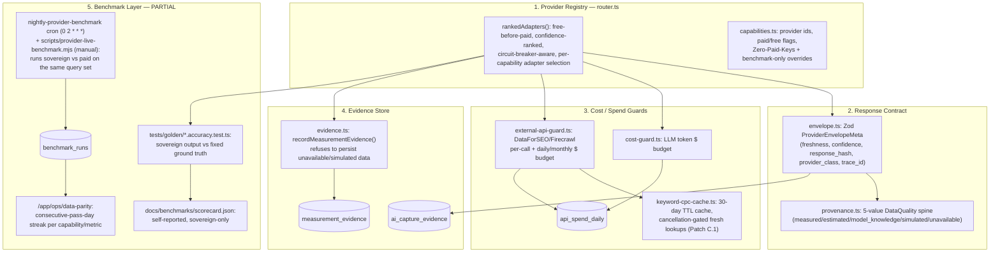

# PresenceData OS

**PresenceData OS is a name, not a new system.** Every pillar described below
already existed as an independent, already-tested file before this document
was written (see `src/lib/presence-data/index.ts`'s commit history / Patch G).
This document ties five existing subsystems together behind one map so a
reader can find the whole in-house data platform without already knowing
which of ~8 files owns which concern — it does not describe aspirational
architecture, and every file path below is real and importable today unless
explicitly marked "planned."

Import surface: `@/lib/presence-data` (re-exports only — see that file's
header comment for why existing direct imports of `@/lib/providers/router`
etc. are still correct and don't need to migrate).

## Why this exists

The PresenceOS mission is to minimize dependence on paid third-party SEO
providers (DataForSEO) by building an owned, defensible data platform using
official/free APIs, sovereign engines (OmniData), and honest provenance —
without ever faking a number or claiming a replacement that hasn't been
benchmark-proven. PresenceData OS is the name for the five pillars that make
that possible:

## Pillar 1 — Provider registry

**File**: `src/lib/providers/router.ts` (+ `src/lib/config/capabilities.ts`
for provider/capability metadata).

- `rankedAdapters(capability)` returns every adapter for a capability
  (`serp | crawl | backlinks | generate | email | social | enrich`), sorted
  free-before-paid, then higher-confidence-first, filtered by circuit-breaker
  health, then cheapest.
- `ZERO_PAID_KEYS` mode (`isZeroPaidKeysMode()` in `capabilities.ts`) drops
  every paid adapter from the ranking entirely — verified in CI by
  `scripts/audit-zero-paid-keys.mjs`, which proves every capability still has
  at least one sovereign (free) adapter.
- `describeProviders()` returns the live status of every adapter (usable now
  or not, and why) — this is what powers the Data Trust Center
  (`/api/projects/[id]/trust`).

## Pillar 2 — Response contract & provenance

**Files**: `src/lib/providers/envelope.ts`, `src/lib/engines/provenance.ts`.

- `buildProviderEnvelope()` produces a `ProviderEnvelopeMeta` (Zod-validated):
  `freshness` (`live|recent|cached|none`), `confidence` (0–1), a
  `response_hash` for reproducibility, `provider_class`, and `trace_id`.
- `DataQuality` is the 5-value spine every measured field on the platform
  carries: `measured | estimated | model_knowledge | simulated | unavailable`.
  Enforced at the DB layer by a `CHECK` constraint across 27 tables
  (`supabase/migrations/0068_fix_data_source_constraints.sql`), not just by
  application convention — see `docs/DATA_CONTRACT.md` for the customer-facing
  meaning of each label.

## Pillar 3 — Cost / spend guards

**Files**: `src/lib/providers/cost-guard.ts` (LLM budget),
`src/lib/providers/external-api-guard.ts` (DataForSEO/Firecrawl budget),
`src/lib/providers/keyword-cpc-cache.ts` (CPC cache, Patch C.1).

- Two independent guards exist because they gate two independent kinds of
  spend, both rolling up into the same `api_spend_daily` ledger:
  `assertWithinBudget()`/`recordSpend()` (LLM tokens) and
  `assertWithinExternalApiBudget()`/`recordExternalApiSpend()` (per-call rate
  limit + daily/monthly USD cap on external paid APIs).
- `keyword_cpc_cache` (30-day TTL, `supabase/migrations/0082_keyword_cpc_cache.sql`)
  sits in front of `getRealKeywordCpc()`/`getRealKeywordCpcDetailed()` so a
  cache hit never touches the network, and `gatherReportData()` checks
  cancellation before ever reaching this block — closing the pre-cancellation
  paid-call gap that Patch C.1 fixed.

## Pillar 4 — Evidence store

**File**: `src/lib/engines/evidence.ts`.

- `recordMeasurementEvidence()` writes to `measurement_evidence`;
  `ai_capture_evidence` rows are written by the AI visibility probe pipeline.
  Both are readable via `GET /api/evidence` (project-access-gated — see
  `tests/security/cross-tenant-evidence.test.ts`, Patch E).
- Refuses to write evidence for `unavailable`/`simulated` data quality — a
  pinned test (`src/lib/engines/__tests__/measurement-evidence.test.ts`)
  proves the evidence store cannot be used to launder a fabricated number
  into something that looks measured.

## Pillar 5 — Benchmark layer (honesty note: partial today)

**Files that exist today**: `tests/golden/**/*.accuracy.test.ts` (sovereign
output vs. a fixed ground-truth fixture — proves internal consistency, NOT
parity with a paid vendor), `scripts/provider-superiority.mjs` (structural
registry + golden-dataset presence check, runnable with `--strict`),
`scripts/provider-live-benchmark.mjs` / `src/lib/engines/provider-benchmark.ts`
(`npm run benchmark:live` — runs OmniData and a paid vendor side-by-side on
the same query set when both are configured), and — as of this patch —
`benchmark_runs` (`supabase/migrations/0083_benchmark_runs.sql`) +
`src/lib/engines/benchmark-writer.ts` + the `nightly-provider-benchmark`
Inngest cron (`src/lib/inngest/functions.ts`, `0 2 * * *`), which runs that
same live comparison every night and writes one row per honestly-derivable
metric into `benchmark_runs`.

**What this closes**: the platform now has a durable, queryable comparison
history instead of only file-based JSON snapshots (`docs/benchmarks/*.json`
still exist and are unaffected — this is additive).

**What this does NOT close** (still honest gaps, not fabricated):
- `benchmark-writer.ts` only derives `failure_rate` and
  `cost_per_successful_result` for crawl/backlinks/serp/generate, plus a
  `backlink_referring_domain_overlap` proxy metric — it does NOT compute
  SERP position delta, rank repeatability, keyword volume/CPC availability,
  domain authority correlation, or PageSpeed/CrUX parity (Section 9 lists all
  of these). Those require extending `provider-benchmark.ts`'s engine itself,
  which is separate follow-up work, not something this patch fabricates.
- `passed` is `null` (never coerced to true/false) whenever a metric wasn't
  actually evaluated that run — no paid vendor configured, or sample size
  below `MIN_SAMPLES_FOR_STATISTICAL_PASS` (10). A capability only becomes
  eligible for promotion once it has **30 consecutive days of real
  `passed = true` rows** for every threshold that applies to it.
- The nightly cron shares the SAME daily/monthly external-API budget as
  customer traffic (`external-api-guard.ts`) — there is no separate
  benchmark-only sub-budget yet. It fails closed (informational-only rows)
  if the shared budget is already spent, never overspends, but this means a
  busy day could reduce how many capabilities get a real paid comparison
  that night. A dedicated benchmark budget tag is a follow-up enhancement.

Until 30 days of real passing evidence accumulates in `benchmark_runs` per
capability, **no claim that OmniData replaces DataForSEO for any capability
is true**, and `router.ts` must not be changed to reflect one. This is the
enforcement gate the plan calls "Patch J" — it is evidence-gated, not
date-gated.

**Patch H (internal parity dashboard)**, added on top of this table, makes
that evidence visible without waiting on Patch J:
`GET /api/admin/benchmark-runs` (`src/app/api/admin/benchmark-runs/route.ts`)
groups `benchmark_runs` rows by `(capability, metric_name)`, collapses
same-day re-runs to the latest run for that day, and derives a *consecutive
calendar-day* pass streak per group (`src/lib/engines/benchmark-dashboard.ts`
— `summarizeBenchmarkRuns()`). A single failing day, a not-evaluated
(`passed: null`) day, or a missing day (cron didn't run) resets that streak
to zero; there is no partial credit and no group is ever reported
"promotion-ready" (`consecutivePassDays >= 30`) without 30 *unbroken* daily
passes. The dashboard UI lives at `/app/ops/data-parity`
(`src/app/app/ops/data-parity/page.tsx`, linked from the ops console) and the
route is gated by the shared `isPlatformAdminAuthorized()` helper
(`src/lib/security/admin-auth.ts` — a `BENCHMARK_SECRET` bearer token, or any
authenticated owner/admin org membership; `benchmark_runs` has no
tenant/organization column, so there is no per-project scope to check
instead).

## What NOT to do with this module

- Do not add new detection/scoring/cost logic to `src/lib/presence-data/`.
  If a pillar needs a new capability, add it to the real owning file (e.g.
  `router.ts`) and it will be visible here automatically via the re-export.
- Do not require existing call sites to migrate their imports to
  `@/lib/presence-data`. This module is for discoverability and for new code
  that wants the whole surface at a glance, not a mandatory funnel.
- Do not describe the benchmark pillar as complete in customer-facing copy
  until it has a `benchmark_runs` table with ≥30 days of real comparisons
  meeting the thresholds in this repo's PresenceData OS plan (Section 9).
